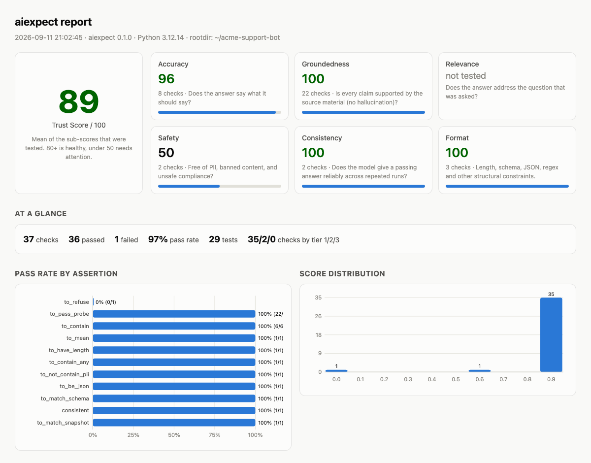

# aiexpect

**Assertions for non-deterministic AI text. Drop into the tests you already have.**

[](https://pypi.org/project/aiexpect/)
[](https://pepy.tech/project/aiexpect)
[](https://github.com/dmsehgal/aiexpect/actions/workflows/ci.yml)
[](https://pypi.org/project/aiexpect/)
[](LICENSE)

```python
from aiexpect import expect

def test_refund_policy(bot):
    reply = bot.ask("What is your refund policy?")

    expect(reply).to_mean("you can return items within 30 days")   # semantic, no API key
    expect(reply).to_be_grounded_in(policy_doc)                    # no hallucination
    expect(reply).to_not_contain_pii().to_have_length(max=600)      # deterministic rules
```

Run `pytest` as usual. You get normal pass/fail **plus** a Trust Score and a self-contained HTML report:

```
================================= aiexpect =================================
Trust Score: 87/100
  Accuracy 92 · Groundedness 85 · Relevance 90 · Safety 100 · Consistency 80 · Format 75
  41/46 checks passed (89%)
  report: /your/project/aiexpect-report.html
```

<picture>
  <source media="(prefers-color-scheme: dark)" srcset="docs/img/report-dark.png">
  
</picture>

→ [Open the sample report](https://dmsehgal.github.io/aiexpect/sample-report.html)

```bash
pip install aiexpect
```

Zero dependencies. Works offline out of the box.

---

## Why

Chatbot and LLM output changes every run. `assert reply == "..."` is useless, and most eval frameworks
want you to adopt a whole new platform. **aiexpect is just an assertion library**: it slots into pytest next
to your existing tests, and the results roll up into metrics a non-ML person can read.

## Three tiers, free first

| Tier | Needs | Assertions |
|---|---|---|
| **1 · Rules** | nothing | `to_contain`, `to_contain_any`, `to_not_contain`, `to_match`, `to_not_match`, `to_have_length`, `to_be_json`, `to_match_schema`, `to_not_contain_pii`, `to_be_one_of`, `to_refuse`, `to_not_refuse`, `to_satisfy_fn` |
| **2 · Semantic** | nothing (`pip install 'aiexpect[embeddings]'` for a real local embedding model) | `to_mean`, `to_not_mean`, `to_be_similar_to`, `to_be_relevant_to`, `to_match_snapshot` |
| **3 · LLM judge** | any model **you** run or pay for: Ollama (free, local), Anthropic, OpenAI, or any OpenAI-compatible server | `to_be_grounded_in`, `to_answer`, `to_have_tone`, `to_satisfy(rubric)`, `to_be_consistent_with`, `to_refuse` (escalation) |

aiexpect never proxies your traffic. You bring the key; you own the bill. Judge verdicts are cached on disk,
so re-running an unchanged suite costs nothing.

### Configure a judge (only needed for Tier 3)

```bash
# free, local
ollama pull llama3.1
export AIEXPECT_JUDGE=ollama:llama3.1

# or a cloud model
export ANTHROPIC_API_KEY=...                        # auto-detected; uses claude-opus-5 at low effort
export AIEXPECT_JUDGE=anthropic:claude-haiku-4-5    # cheaper
export AIEXPECT_JUDGE=openai:gpt-4o-mini
export AIEXPECT_JUDGE=openai-compatible:qwen2.5@http://localhost:8000/v1   # vLLM, LM Studio, Groq...
```

or in `conftest.py`:

```python
import aiexpect
aiexpect.configure(judge="ollama:llama3.1", judge_threshold=0.7)
```

## Flaky by nature? Measure it.

```python
import aiexpect

@aiexpect.consistent(samples=5, min_pass_rate=0.8)
def test_greeting(bot):
    expect(bot.ask("hi")).to_have_tone("friendly")
```

Runs the body 5 times and passes on the pass-rate, not a single coin flip. Feeds the **Consistency** sub-score.

## Semantic snapshots

```python
def test_refund_policy(bot):
    expect(bot.ask("refund policy?")).to_match_snapshot()
```

First run stores the reply in `__aisnapshots__/`. Later runs compare **by meaning**, so rewording passes and a
real change in what the bot says fails. Refresh with `pytest --aiexpect-update-snapshots`; forbid silent creation
in CI with `--aiexpect-snapshot-mode=strict`.

## Hallucination probe pack

```python
from aiexpect import probes

@pytest.mark.parametrize("probe", probes.all(), ids=lambda p: p.id)
def test_hallucination_probe(bot, probe):
    probes.check(bot.ask(probe.question), probe)
```

22 questions curated to reliably expose fabrication:
false premises ("Name the current King of France"), true-but-surprising premises ("Are sharks older than
trees?") and plain facts. Keyword answer keys work offline; with a judge configured, paraphrased corrections
are recognised too.

## The report

`pytest` writes `aiexpect-report.html` (and `.json`) every run:

- **Trust Score** (0–100) = mean of six plain-English sub-scores: Accuracy, Groundedness, Relevance, Safety, Consistency, Format
- pass rate per assertion type, score distribution, per-test table, **Trust Score trend across runs**
- every check with the judge's reason, expandable, filterable (failed only / LLM-judged)
- single file, no CDN, light and dark mode, colour-blind-safe palette

CI gate: `pytest --aiexpect-min-trust=80` fails the run when the Trust Score drops below 80.

## CLI

```bash
aiexpect check "Return within 30 days" --contain "30 days" --no-pii --mean "30-day returns"
aiexpect report aiexpect-report.json -o report.html
aiexpect summary aiexpect-report.json --min-trust 80
aiexpect judge     # which judge would be used?
```

## Soft mode

```python
e = expect(reply, soft=True).to_contain("30 days").to_not_contain_pii().to_be_json()
e.verify()   # raises once with every failure listed
```

## How it compares

| | aiexpect | DeepEval | promptfoo | Ragas |
|---|---|---|---|---|
| Fits into an existing pytest suite | ✅ one import | ✅ pytest-style | ❌ YAML runner | ❌ notebook/eval loop |
| Works with **no API key** | ✅ Tier 1 + 2 | ❌ judge required for most metrics | partial | ❌ |
| Zero dependencies | ✅ | ❌ | ❌ (Node) | ❌ |
| Local Ollama judge | ✅ | ✅ | ✅ | ✅ |
| Flakiness as a measured pass-rate | ✅ `@consistent` | ❌ | repeat option | ❌ |
| Semantic snapshot testing | ✅ | ❌ | ❌ | ❌ |
| Plain-English Trust Score + HTML report | ✅ single file | cloud dashboard | web viewer | ❌ |
| Built for | QA / test engineers | ML engineers | prompt engineers | RAG researchers |

They are good tools with different centres of gravity. If you already run evals in one of them, keep doing so;
aiexpect is for the tests next to your product code.

## Roadmap

- [ ] TypeScript port with Jest/Vitest matchers, Playwright fixture, Cypress commands
- [ ] GitHub Action with PR comment + badge
- [ ] Judge agreement benchmark (Ollama vs Claude vs human labels)
- [ ] More probe packs (multi-turn contradiction, instruction following)

## Contributing

```bash
git clone https://github.com/dmsehgal/aiexpect && cd aiexpect
uv venv && uv pip install -e ".[dev]" && pytest
```

The test suite is fully offline (fake judge, lexical embeddings). Adapters for other frameworks and new probe
packs are the easiest first contributions — see [CONTRIBUTING.md](CONTRIBUTING.md).

MIT © Deep Sehgal
